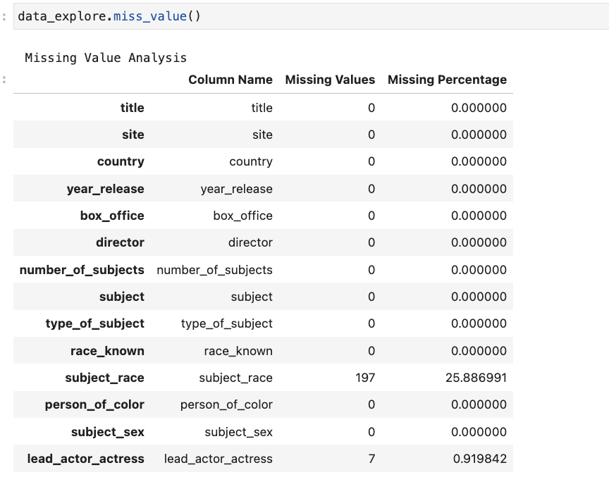
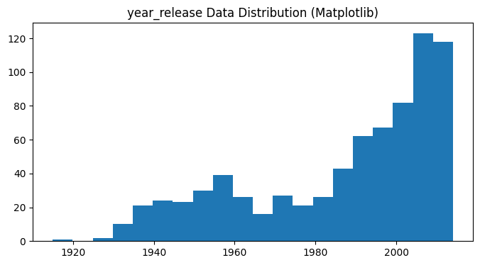

# Project1

### 1.Introduction

​	The dataset "Biopics" is derived from the story ['Straight Outta Compton' Is The Rare Biopic Not About White Dudes](http://fivethirtyeight.com/features/straight-outta-compton-is-the-rare-biopic-not-about-white-dudes),  as featured on FiveThirtyEight. The data originates from [IMDb](http://www.imdb.com/), a popular online database of films, television programs, and related content. This dataset encompasses information related to biographical films, commonly known as biopics, along with their attributes. The dataset primarily aims to explore and understand the diversity and characteristics of biographical films, particularly in terms of their subjects and subjects' backgrounds.

​	The dataset is stored in CSV format, containing both text and numeric data types. Through this dataset, we aim to research the following questions:

1. **Development of Biographical Film Box Office:** How has the box office of biographical films changed over the years?

2. **Gender Preferences:** Do biographical film subjects exhibit gender preferences? And does it changed over the years?

3. **Racial Preferences:** Do biographical film subjects exhibit racial preferences?

   

### 2.Data Summary

2.1 Data link

​     We acquired the data from this GitHub repository: https://github.com/fivethirtyeight/data/tree/master/biopics. 

2.2 Data information

​	In DataSummary.py file, we write DataSummary class with the summary function.

 To print the Data information in jupyter notebook we can get:


​	By looking at the returned values, we can see that there are a total of 761 cases in the dataset, each having 14 attributes. The specific names and data types of each attribute are listed below, with 'object' indicating text data. 


​	This is an overall overview of the data. In other words, it has 761 rows and 14 columns.

2.3 Attributes details

`biopics.csv` contains the following attributes:

| Attributes           | Definition                                                   |
| -------------------- | ------------------------------------------------------------ |
| `title`              | Title of the film.                                           |
| `site`               | URL from IMDB.                                               |
| `country`            | Country of origin.                                           |
| `year_released`      | Year of release.                                             |
| `box_office`         | Gross earnings at U.S. box office.                           |
| `director`           | Director of film.                                            |
| `number_of_subjects` | The number of subjects featured in the film.                 |
| `subject`            | The actual name of the featured subject.                     |
| `type_of_subject`    | The occupation of subject or reason for recognition.         |
| `race_known`         | Indicates whether the subject’s race was discernible based on background of self, parent, or grandparent. |
| `subject_race`       | Race of the subject.                                         |
| `person_of_color`    | Dummy variable that indicates person of color.               |
| `subject_sex`        | Sex of subject.                                              |
| `lead_actor_actress` | The actor or actress who played the subject.                 |


### 3.Exploratory Data Analysis (EDA)

3.1 Summary statistics

​	 Firstly we analysis the missing values in each attribute, with the miss_value function in DataExploration class. See details in DataAnalysis.py file, and the return results are:



​	From the table above, there are 197 values missed in subject_race attribute and 7 values missed in lead_actor_actress attribute. Here the missing value means the data value is None.

​	To provide the summary statistics for each attribute, we define a visualize_data function in DataExploration class. We counted the occurrences of each data value in each attribute and presented them in the form of histograms. We first used Matplotlib to create the plots and then used Seaborn. The results are analyzed in detail in Section 3.2.

```python
def visualize_data(self,column_name):
  if column_name in self.dataset.columns:
    column_data = self.dataset[column_name]
    summary_stats = column_data.describe()

    if column_data.dtype == 'object':
      ## process the column with string(object) data type

      plt.figure(figsize=(8, 4))
      ## calculate frequency
      value_counts = column_data.value_counts().sort_values(ascending=False)

      ## visualize with Matplotlib
      plt.bar(value_counts.index, value_counts.values)
      plt.title(f"{column_name} Data Distribution (Matplotlib)")
      plt.xticks(rotation=45)
      plt.show()

      ## visualize with Seaborn
      plt.figure(figsize=(8, 4))
      sns.barplot(x=value_counts.index, y=value_counts.values)
      plt.title(f"{column_name} Data Distribution (Seaborn)")
      plt.xticks(rotation=45)
      plt.show()

    else:
      ## process the column with int data type
      ## visualize with Matplotlib
      plt.figure(figsize=(8, 4))
      plt.hist(column_data.dropna(), bins=20)
      plt.title(f"{column_name} Data Distribution (Matplotlib)")
      plt.show()

      ## visualize with Seaborn
      plt.figure(figsize=(8, 4))
      sns.histplot(data=column_data.dropna(), bins=20, kde=True)
      plt.title(f"{column_name} Data Distribution (Seaborn)")
      plt.show()

    else:
      summary_stats = None

      return summary_stats

```


3.2 Analysis for each attribute	

 1. Title 

    

​		  From the histogram, it can be observed that there are hardly any significant repetitions in the titles of biographical films. 		  The maximum number of overlaps is four times, with only a few occurrences of three or two repetitions.

2. Site

   

   ​		The site means the website link for the corresponding film, so the histgram of site attribute is the same as the one of title, which is illustrated above.

3. Country

   

   ​		The main countries for biographical movies are the US, UK, and Canada. It can be seen that the number of biographical movies in the US far exceeds other countries, with nearly 500 films, while the dataset contains a total of over 700 movies. The quantity from the US accounts for well over half of the total.

4. Year_release

   

   ​		From the graph, it can be observed that the number of biographical movies generally increases year by year over time. After 2010, there are almost 120 biographical movies per year. The visual effect in Seaborn reveals two peaks, around 1958 and 2010, with a small dip in between, approximately around 1970.

5. Box_office

   ​		The 'box_office' attribute means the gross earnings at U.S. box office. First, it is observed that the 'box_office' attribute in the dataset is of object (string) type, for example, '\$56.7M' and \'\$537K'. Therefore, it needs to be preprocessed to be converted into an integer data type. The preprocessing function with the name of 'preprocess', is defined in the 'DataExploration' class in the 'DataAnalysis.py' file. For specific details, please refer to the code.

   

   ​		From the chart, it can be seen that the movie box office follows a long-tail distribution, which is highly uneven. The majority of movie box office figures are distributed below 50,000,000 dollars, with only a very small number of movies exceeding 150,000,000, and even 300,000,000 dollars. The following figure provides statistical information about movie box office, with movies having a value of 0 indicating that box office information was not available.

   

   

6. Number_of_subjects

   

   Most biographical movies feature only one subject, with very few having 3 or 4 subjects.

7. Type_of_subjects

   ​		The 'type_of_subjects' attribute means the occupation of subject or reason for recognition, like 'Criminal', 'Athlete', 'Musician', 'Academic', etc. 

   

   ​		The most common subject types are "criminal," "musician," "historical," and "athlete." Following them in prevalence are "author," "military," and "artist."

8. Race_known

   

   ​		The 'race_known' attribute indicates whether a movie has a clearly defined 'race' attribute value. There are approximately 200 movies in which the 'race' attribute is not explicitly known. We can use the 500+ movies with clearly defined race attributes for the race analysis.

   

9. Subject_race

   

   ​		It can be observed that the number of biographical movies with the "White" racial category far exceeds other categories, dominating as the absolute majority, accounting for more than half of the total number of movies.

10. Person_of_color

    

    The 'person_of_color' attribute means dummy variable that indicates person of color. From the table, it can be seen that over 600 biographical movies do not feature characters of color, while there are only around 100 movies that are about characters of color.

11. Subject_sex

    

    ​		From the chart, it is evident that the number of biographical movies about males is nearly three times that of females, indicating a preference for male subjects in biographical movies with regard to gender.


### 4.Inference

4.1 Development of Biographical Film Box Office

​		In order to calculate the trend of box office earnings for biographical movies over time, we have defined a function called 'box_year_analysis'. This function is located within the 'Inference' class in the 'Inference.py' file. It computes the total box office earnings for each year, and the results are as follows:


​		From the chart, it can be inferred that the total box office earnings of all biographical movies have been increasing year by year. Additionally, as the years have progressed, there is a denser concentration of years with high box office earnings. This suggests that consumer interest in biographical movies is gradually rising.

4.2 Gender Preferences

​		In Section 3.2, we found that biographical movies exhibit a gender preference towards males. To assess if the degree of this preference has changed over time, we separately counted the number of biographical movies about males and females each year, and the results are shown in the following chart. We have defined a function called 'gender_analysis_by_year', locating within the 'Inference' class in the 'Inference.py' file.


​		It can be observed that in earlier decades, the gender preference for biographical movies was not particularly evident, with slightly more male-focused biographical movies than female-focused ones. However, in recent years, as the number of biographical movies has rapidly increased, this difference has become increasingly significant, with male-focused movies being two to three times more prevalent than female-focused ones.

4.3 Racial Preferences

​	In 3.2 Section, the analysis of 'subject_race' and 'Person_of_color' attributes indicates the biographical film subjects exhibiting racial preferences, with much more preference to 'White' race than any other race.


### 5.Conclusion

This analysis of biographical movies revealed several key findings:

1. There is a consistent increase in the number of biographical movies over time, with notable peaks in the late 1950s and early 2000s.

2. Box office earnings for these movies exhibit a long-tail distribution, with most movies earning less than $500,000.

3. There is a strong preference for White subjects in biographical movies, with the majority of movies focusing on male subjects.

4. Gender preferences have become more pronounced in recent years, with male-focused movies outnumbering female-focused ones.


In summary, this analysis provides valuable insights into the trends and preferences within the biographical movie genre.

### Reference

Molin S. Hands-On Data Analysis with Pandas: Efficiently perform data collection, wrangling, analysis, and visualization using Python[M]. Packt Publishing Ltd, 2019.